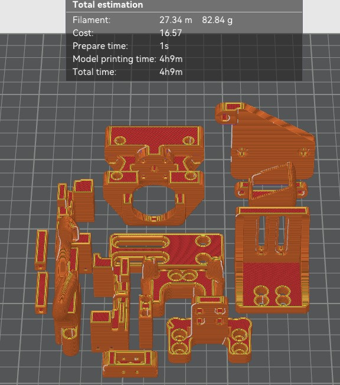

1. Mengirimkan file ke [Whatsapp](https://wa.me/message/CYHQT7FFRGG3C1) bisa dalam format STEP/ 3MF/ STL/ OBJ atau link ke [Thingiverse](thingiverse.com) ataupun [Printables](printables.com)

   
   
2. bisa skip step ini jika tidak ingin repot atau bisa memilih [parameter](./parameter.md) yang diinginkan
3. Kami akan menghitungkan berat hasil print seperti
   
4. agan bisa order di [tokopedia](https://tokopedia.link/dJQMcHJHPyb) dengan memilih warna, layer height yang sudah dipilih, lalu masukan jumlah pcs sesuai berat filament yang diberikan oleh kami di step 3
5. orderan akan diprint sesuai antrian
6. finishing
7. orderan dikirim
   
