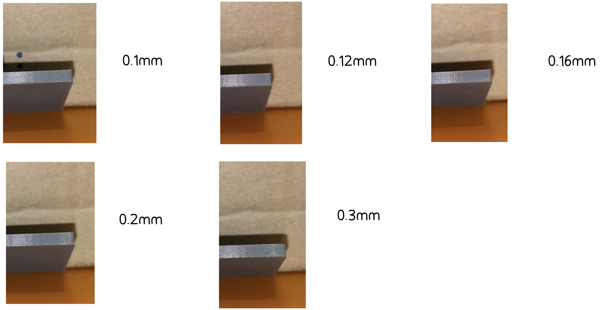
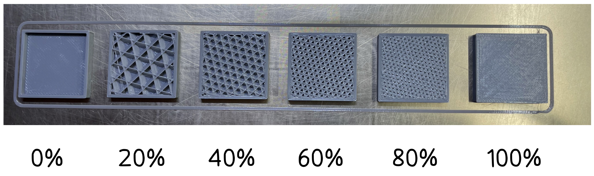

# Material

Saat ini kami hanya menerima material PLA+, PETG, dan TPU 95A

## PLA+

PLA adalah material plastik paling umum digunakan untuk 3d printing. PLA memiliki kelebihan dibandingkan dengan material lainnya karena bahan ini lebih mudah untuk diprint dan harganya yang terjangkau, namun memiliki kekurangan yaitu mulai lembek pada termperatur 55° C dan leleh pada temperatur 180° C sehingga tidak cocok untuk diaplikasikan pada lingkungan dengan temperatur tinggi. 

## PETG

PETG adalah material plastik kedua yang paling umum digunakan karena sifatnya yang lebih kuat daripada PLA dan lebih tahan dari panas dan juga sinar UV. PETG adalah material yang mirip dengan material botol kemasan sekali pakai. Kekurangan dari PETG adalah hasil print yang akan sedikit lebih tidak baik daripada PLA.

*Hasil dari print PETG akan sedikit lebih tidak mulus dibanding PLA karena material PETG lebih sulit untuk diprint 

Pelajari lebih lanjut [PLA and PETG Comparasion](https://all3dp.com/2/petg-vs-pla-3d-printing-filaments-compared/)

## TPU 95A

TPU 95A adalah material flexibel cocok untuk print objek seperti ban mainan

# Parameter print yang dapat dipilih

## Layer height

Kami menerima layer height 0.1mm hingga 0.2mm dan semakin kecil layer height, maka hasil akan semakin bagus. Layer height settingan normal kami adalah 0.2mm karena dengan nominal segitu, hasil yang didapatkan sudah cukup bagus untuk print benda umum dan keuntungan lainnya adalah harga yang lebih murah. Untuk print benda yang kecil atau miniatur, layer height kecil seperti 0.12mm lebih dianjurkan agar garis-garis antar layer tidak terlalu terlihat. 

Pelajari lebih lanjut [3d print layer height](https://all3dp.com/2/3d-printer-layer-height-how-much-does-it-matter/)

## Infill

Kami menerima settingan infill dari 5%-100% dimana pada 100%, benda print isinya padat (tidak ada rongga-rongga). Settingan normal yang kami pakai adalah infill cubic 20% karena sudah cukup kuat untuk beban normal dan hasil print relatif ringan. Untuk benda yang membutuhkan beban extra, direkomendasikan untuk memilih settingan infill diatas 40% agar benda menjadi lebih kuat.

Pelajari lebih lanjut [3d print infill](https://all3dp.com/2/infill-3d-printing-what-it-means-and-how-to-use-it/)

## Warna

### PLA+

untuk saat ini tersedia warna hitam, grey, silver, putih, merah, hijau, biru, dan cyan

### PETG

untuk saat ini tersedia warna hitam, grey, dan putih

### TPU

hanya tersedia warna hitam

### Next: [Slicer Setting](./slicersetting.md)
