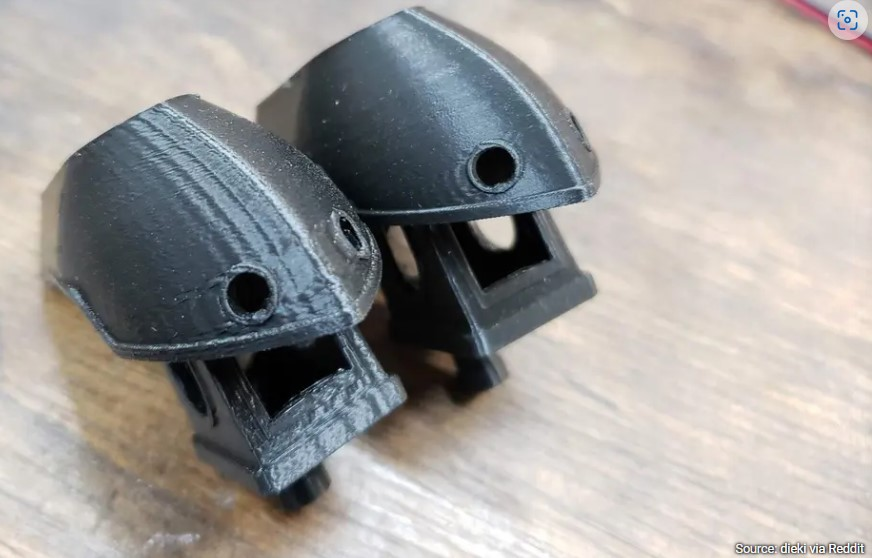
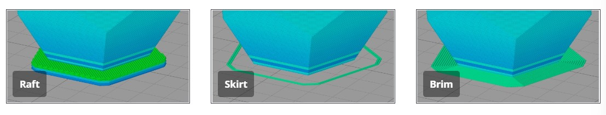

# Slicer

Kami menggunakan slicer Orca slicer yang merupakan anak dari prusa slicer. 

## Quality

### First layer height

Kami menggunakan first layer height 0.3mm yang dibutuhkan agar first layer terprint dengan sempurna

### Line width

Kami menggunakan default layer width 0.45mm namun untuk setiap line type, ada sedikit penyesuaian. Kami juga menggunakan wall generator Arachne yang merupakan variable perimeter generator.

selengkapnya di [Arachne perimeter generator](https://all3dp.com/2/cura-ironing-3d-printing-ironing/)

### Arc Fitting

Kami menggunakan arc welder agar hasil print lebih mulus dan lebih cepat dan fitur ini hanya ada di firmware klipper

selengkapnya di [Arc move](https://wiki.bambulab.com/en/software/bambu-studio/high-speed-print-at-quality)

### Ironing

Kami tidak menggunakan settingan ini karena hasil yang didapatkan kurang memuaskan karena adanya over-extrusion di bagian pinggir objek dan tidak cocok untuk objek dengan bentuk yang tidak memiliki permukaan atas yang luas seperti bola. Untuk mendapatkan hasil serupa, kami menggunakan parameter khusus agar hasil permukaan atas serupa dengan ironing namun tanpa efek negatifnya. 

selengkapnya di [ironing](https://all3dp.com/2/cura-ironing-3d-printing-ironing/)

## Strength

### Wall loops

Kami menggunakan 3 wall loops untuk settingan normal agar hasil print lebih kuat dan agar infill tidak terlihat. Jasa print kompetitor biasanya hanya menggunakan 2 wall loops yang akan menghemat waktu print namun kekuatan print akan berkurang. 

### top/bottom shells

Untuk top surface pattern kami menggunakan monotonic line karena hasil yang didapatkan merupakan yang terbaik dan untuk bottom surface pattern kami menggunakan monotonic.

Top dan bottom thickness yang kita pilih adalah 6 layers dan 1.2mm untuk ketebalannya. Parameter ini dipilih karena akan menutup bagian atas print dengan sempurna tanpa terlihat isi infill. Kompetitor biasa hanya menggunakan 3/4 layers untuk top dan bottom thickness karena akan menghemat banyak waktu print. 

### Infill 

Infill normal kami adalah 20% namun bisa diubah sesuai dengan keinginan konsumen

## Speed

### speed

kecepatan yang kita set lebih cepat dari kecepatan print kompetitor karena printer kami sanggup untuk print dalam kecepatan tinggi tanpa mengurangi kualitas. Untuk menangani kecepatan yang lebih tinggi, stepper motor yang digunakan sudah diupgrade agar memiliki torsi yang lebih besar, kami juga mengutilisasi fitur kippper yaitu input shaping yang berguna untuk mengurangi/menghilangi ringing

baca selengkapnya di [input shaping](https://all3dp.com/2/klipper-input-shaping-simply-explained/)

Untuk print pada kecepatan yang lebih tinggi, kami menggunakan printhead yang memiliki kemampuan untuk mengeluarkan plastik dalam kecepatan volumetric tinggi serta menggunakan nozzle CHT.

baca selengkapnye mengenai [CHT Nozzle](https://www.cnckitchen.com/blog/bondtech-cht-high-flow-nozzle-reviewed)

### acceleration

akselerasi yang kami pakai disesuaikan dengan kecepatan yang dipilih agar kecepatan max yang dipilih tercapai. 

## Support

Kami menggunakan support di semua print kami kecuali ada request khusus dari konsumen. 

Tipe support yang digunakan menyesuaikan dengan objek yang akan di print. Objek dengan bentuk menyerupai kotak akan menggunakan normal support sedangkan objek berbentuk patung akan menggunakan tree support.

Baca selengkapnya di [Support setting](https://wiki.bambulab.com/en/software/bambu-studio/support)

## skirt/brim

kita menggunakan skirt atau brim tergantung dengan objek yang akan di print. Objek dengan permukaan dasar kecil akan menggunakan brim yang lebih besar daripada objek dengan permukaan dasar awal besar.

Sumber: [Simplyfy3D](https://www.simplify3d.com/resources/articles/rafts-skirts-and-brims/)

baca selengkapnya di [Rafts, Skirts and Brims!](https://www.simplify3d.com/resources/articles/rafts-skirts-and-brims/)

### Next: [The Build](./build/index.md)
